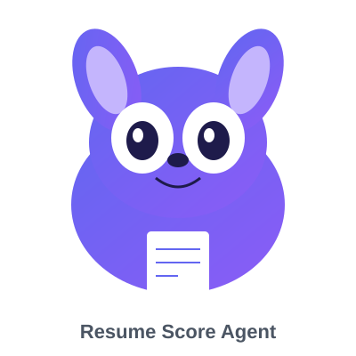

<p align="center">
  
</p>

<h1 align="center">🎯 简历智能打分 Agent</h1>

<p align="center">
  基于 <strong>FastAPI + React + SQLite</strong> 的端到端简历打分应用，集成 OpenAI LLM 与 Tavily 联网搜索
</p>

<p align="center">
  <a href="README.md">中文</a> | <a href="README_EN.md">English</a>
</p>

---

## ✨ 功能特性

- 📄 **简历管理**：支持 PDF/DOCX/PPTX/XLSX/HTML/图片等多格式上传，智能文本解析
- 🤖 **智能打分**：四维度评分（技能/经验/教育/项目）+ 总分 + 改进建议 + 学习资源 + Token统计
- 🌐 **联网搜索**：集成 Tavily Search API，自动搜索公司和岗位信息
- 🎤 **模拟面试**：基于简历自动生成面试问题，AI 评估回答并给出参考答案
- 📊 **历史记录**：保存所有打分记录，支持查看/删除/跳转面试
- ⚙️ **在线配置**：在线修改 API Key 和模型配置，支持多家 LLM 服务商

## 🛠️ 技术栈

| 层级 | 技术 |
|------|------|
| **后端** | FastAPI / SQLAlchemy / SQLite / OpenAI SDK / Tavily Search / liteparse / markitdown / PyMuPDF |
| **前端** | React 18 / Vite / TailwindCSS / Axios |

## 🚀 快速开始

```bash
git clone https://github.com/wt521-888/agent.git
cd agent
cp .env.example .env
cd backend
pip install -r requirements.txt
python main.py
```

前端：http://localhost:5173 | 后端：http://localhost:8000

## 📁 项目结构

```
agent/
├── backend/
│   ├── main.py
│   ├── database.py
│   ├── models.py
│   ├── schemas.py
│   ├── routers/
│   │   ├── resumes.py
│   │   ├── scoring.py
│   │   ├── interview.py
│   │   └── config.py
│   └── services/
│       ├── llm_service.py
│       ├── resume_parser.py
│       ├── interview_service.py
│       └── search_service.py
├── frontend/
│   └── src/components/
├── .env.example
└── README.md
```

## 🔧 API 接口

| 接口 | 方法 | 说明 |
|------|------|------|
| /api/resumes/upload | POST | 上传简历 |
| /api/resumes | GET | 简历列表 |
| /api/score | POST | 简历打分 |
| /api/score/history | GET | 历史记录 |
| /api/interview/questions | POST | 生成面试问题 |
| /api/interview/evaluate | POST | 评估面试回答 |
| /api/config | GET/PUT | 配置管理 |

## 🔗 链接

- [GitHub 仓库](https://github.com/wt521-888/agent)

## 📄 License

MIT License

<p align="center">Made with ❤️ by wt521-888</p>