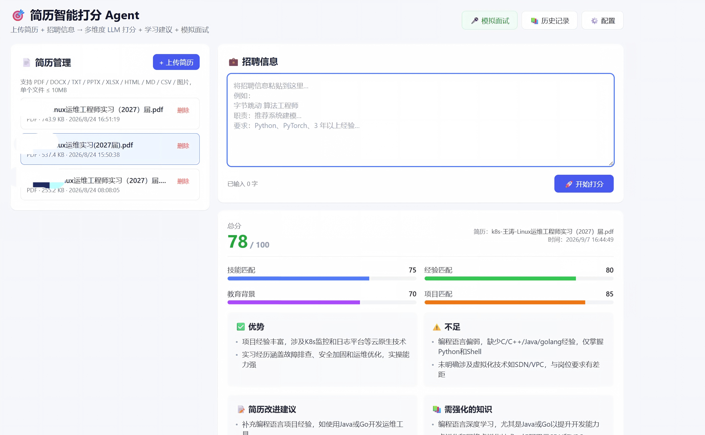
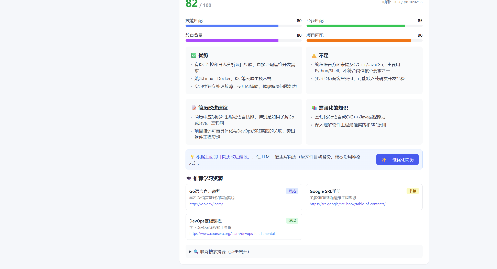
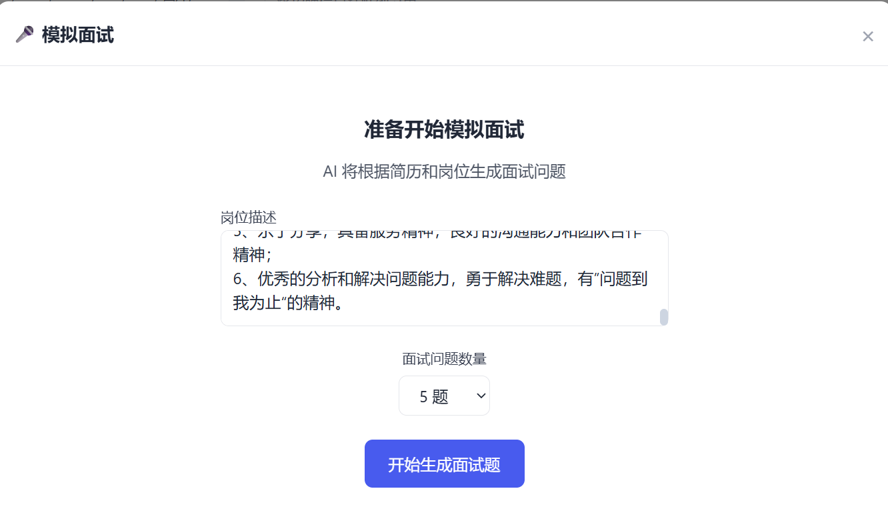
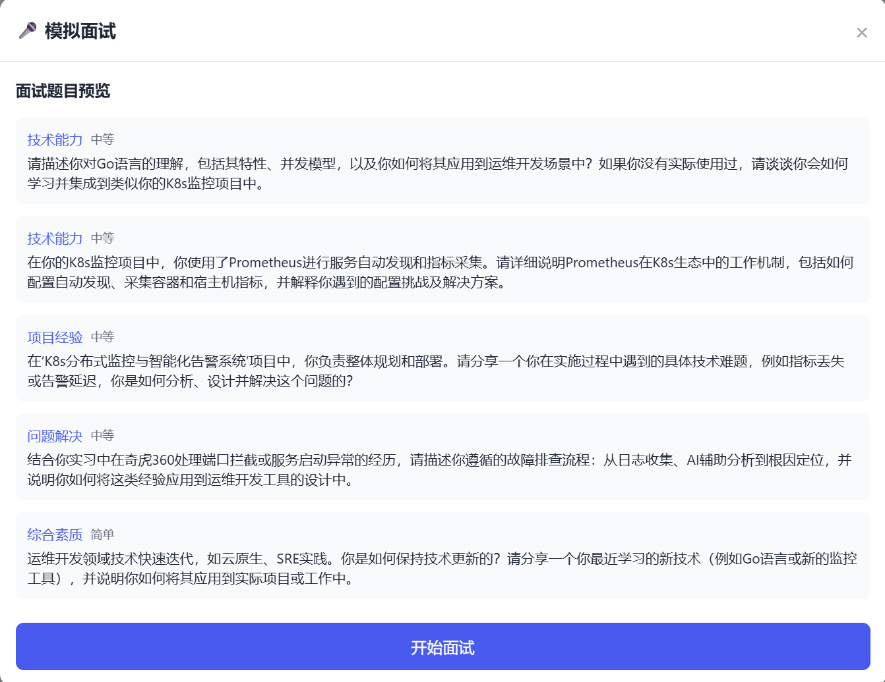
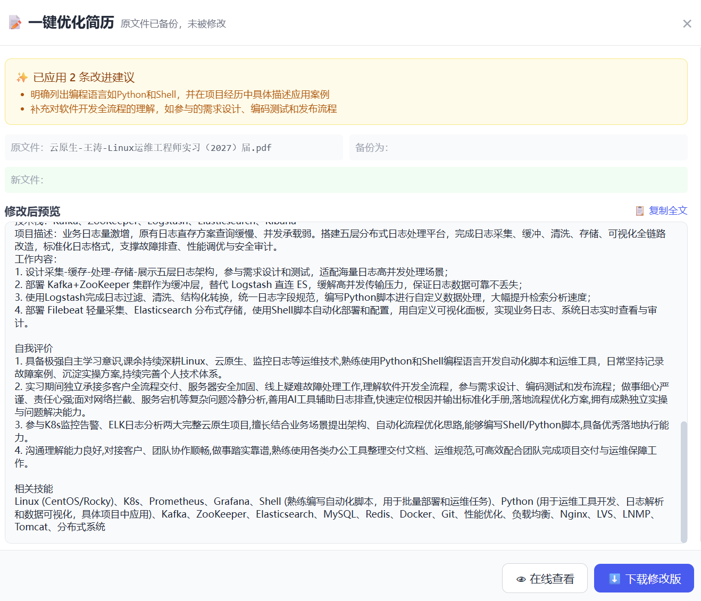
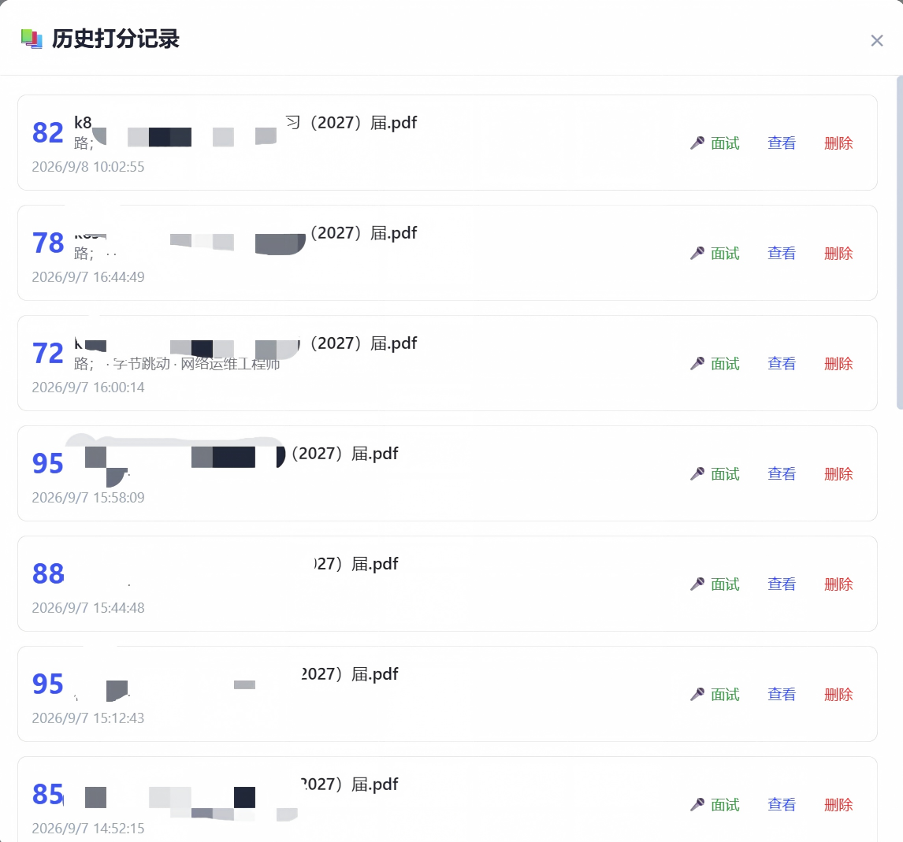
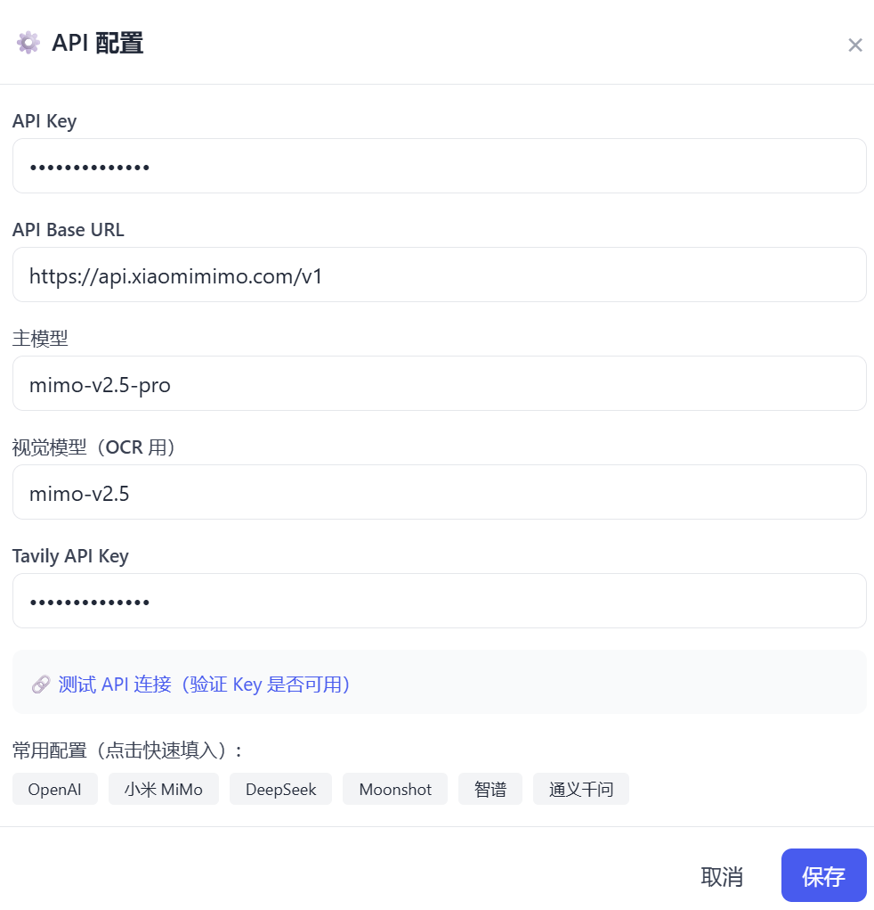

<p align="center">
  
</p>

<h1 align="center">🎯 简历智能打分 Agent</h1>

<p align="center">
  基于 <strong>FastAPI + React + SQLite</strong> 的端到端简历打分应用，集成 OpenAI LLM 与 Tavily 联网搜索
</p>

<p align="center">
  <a href="README.md">中文</a> | <a href="README_EN.md">English</a>
</p>

---

## ✨ 功能特性

- 📄 **五级兜底解析**：LiteParse → markitdown → PyPDF2 → pdfplumber → 视觉 LLM OCR，支持 19 种格式
- 🤖 **智能打分**：四维度评分（技能/经验/教育/项目）+ 总分 + 改进建议 + 学习资源 + Token 统计
- 🌐 **联网搜索**：集成 Tavily Search API，自动搜索公司和岗位信息
- 🎤 **模拟面试**：根据简历和岗位动态生成问题，四维度实时评估回答并输出改进建议
- 📊 **历史记录**：保存所有打分记录，支持查看/删除/跳转面试
- ⚙️ **在线配置**：支持 OpenAI/DeepSeek/智谱/通义等 6+ 厂商热切换，修改即时生效
- 📈 **解析统计**：实时追踪各引擎解析成功率

## 🛠️ 技术栈

| 层级 | 技术 |
|------|------|
| **后端** | FastAPI / SQLAlchemy / SQLite / OpenAI SDK / Tavily Search |
| **解析引擎** | LiteParse / markitdown / PyPDF2 / pdfplumber / PyMuPDF + Vision OCR |
| **前端** | React 18 / Vite / TailwindCSS / Axios |

## 📁 支持格式

| 类型 | 格式 |
|------|------|
| 文档 | PDF / DOCX / DOC / TXT / RTF |
| 演示 | PPTX / PPT |
| 表格 | XLSX / XLS / CSV |
| 网页 | HTML / HTM / MD |
| 图片 | JPG / JPEG / PNG / BMP / TIFF |

## 🚀 快速开始

**首次启动：**
```bash
git clone https://github.com/wt521-888/agent.git
cd agent
cp .env.example .env
pip install -r backend/requirements.txt
cd frontend && npm install && cd ..
```

**日常启动（每次只需）：**
```powershell
# 终端1 - 启动后端
python start.py backend

# 终端2 - 启动前端
python start.py frontend
```

前端：http://localhost:5173 | 后端：http://localhost:8000

## 📁 项目结构

```
agent/
├── backend/
│   ├── main.py                   # FastAPI 入口
│   ├── database.py               # 数据库配置
│   ├── models.py                 # 数据模型（Resume/ScoreRecord/ScoreCache）
│   ├── schemas.py                # Pydantic 验证模型
│   ├── routers/
│   │   ├── resumes.py            # 简历管理（上传/列表/删除/优化）
│   │   ├── scoring.py            # 打分（缓存+瘦身+正则优先+Token统计）
│   │   ├── interview.py          # 模拟面试
│   │   ├── modify.py             # 简历修改
│   │   └── config.py             # 配置管理（大模型热切换）
│   └── services/
│       ├── llm_service.py        # LLM 调用（容错JSON解析+正则优先提取）
│       ├── resume_parser.py      # 五级兜底解析引擎+解析统计
│       ├── interview_service.py  # 面试服务
│       └── search_service.py     # Tavily 联网搜索
├── frontend/
│   └── src/components/
├── tessdata/                     # Tesseract OCR 数据（可选）
├── .env.example
└── README.md
```

## 🔧 API 接口

| 接口 | 方法 | 说明 |
|------|------|------|
| /api/resumes/upload | POST | 上传简历 |
| /api/resumes | GET | 简历列表 |
| /api/resumes/parse-stats | GET | 解析引擎统计 |
| /api/score | POST | 简历打分（带缓存+Token统计） |
| /api/score/history | GET | 历史记录 |
| /api/interview/questions | POST | 生成面试问题 |
| /api/interview/evaluate | POST | 评估面试回答 |
| /api/config | GET/PUT | 配置管理 |

## 📸 项目展示

<p align="center">
  
</p>

<p align="center">
  
</p>

<p align="center">
  
</p>

<p align="center">
  
</p>

<p align="center">
  
</p>

<p align="center">
  
</p>

<p align="center">
  
</p>

## 📄 License

MIT License

<p align="center">Made with ❤️ by <a href="https://github.com/wt521-888">wt521-888</a></p>

